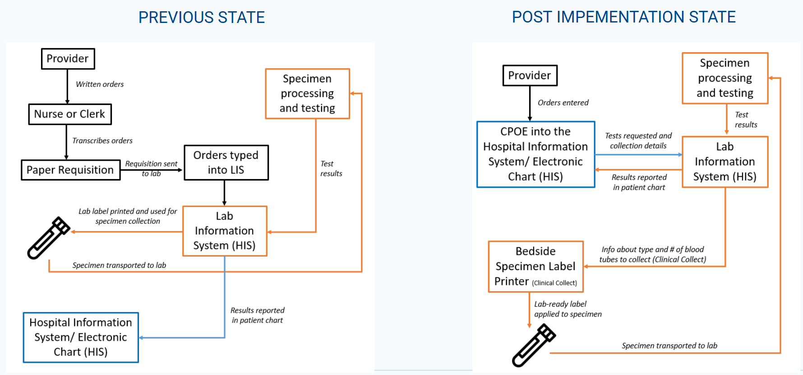

## Executive Summary

BC Children's Hospital (BCCH) implemented Computerized Provider Order Entry (CPOE) as part of the Clinical & Systems Transformation (CST) initiative. These systems were intended to improve laboratory ordering, specimen collection, patient identification, workflow transparency, and access to laboratory results. This Capstone project will evaluate whether these expected benefits are reflected in the available electronic health record (EHR) and laboratory information system (LIS) data, while also identifying unintended workflow or data pattern changes that may affect pediatric laboratory service delivery.

Our proposed output is a reproducible analysis workflow, a concise summary of validated findings, and a dashboard prototype that BCCH can use to monitor selected laboratory process metrics over time. The project will focus on clear, defensible, and partner relevant analysis.

## Background and System Transition

Before CST, laboratory orders followed a paper heavy workflow. Providers wrote orders, nurses or clerks transcribed them onto requisitions, laboratory staff manually entered them into the Laboratory Information System (LIS), and labels were generated after multiple handoffs. This led to transcription errors, duplicate work, delayed visibility, and specimen labeling problems.

With the implementation of CST, providers enter orders directly into the electronic health record (EHR). Orders are transmitted to the LIS, and Clinical Collect supports bedside patient identification and label generation. In principle, this should reduce transcription steps, improve positive patient identification, reduce unnecessary collections, and improve turnaround time. @fig-system-transition illustrates how lab orders moved from handwritten requisitions and manual LIS entry to direct electronic ordering, bedside specimen labeling, and digital result reporting.

{#fig-system-transition fig-align="center" width="90%"}

*Source: Adapted from BCCH project slides and MDS Student Prep aims.*

## Research Questions

The partner seeks to understand whether replacing paper based workflows with CPOE/CST supported laboratory ordering improved pediatric service delivery, and whether the transition introduced unintended consequences. We address this through 9 analytical objectives:

1.  What proportion of blood collection events use Clinical Collect? Where in the hospital is Clinical Collect used, and how does use vary by location and time of day?
2.  Who uses Clinical Collect, and does use differ between lab and non-lab personnel? Is Clinical Collect being used correctly, based on device/collector patterns and collection-to-receipt timing?
3.  What is the rate of mislabeled specimens, and does it vary by hospital area, user group, test type, or Clinical Collect use?
4.  Have turnaround times improved for selected tests pre and post CPOE, and how do they vary by hospital location, collector group, and test type?
5.  Are incorrect, credited, cancelled, or reordered tests reduced after CST ? Where do these events occur, how often and by whom?
6.  How many orders are placed but not completed, and do incomplete order patterns vary by location or provider/workflow group?
7.  Has lab ordering been standardized? Are existing ordersets sufficient, or are providers customizing them?
8.  Did the number or frequency of blood collection events per patient change after CST, number of pokes, number of providers placing orders, and by location?
9.  Did test utilization change for selected high interest tests or hospital locations?

## Data & Exploratory Data Analysis (EDA)

The analysis will be conducted in the secure PAWS environment using linked EHR and LIS data from the main sources summarized in @tbl-data-landscape below.

The observational unit varies by research question: order, order item, or test level for utilization, container ID for tube analyses (parent and child/decanted handled separately), derived collection events (accessions grouped by patient and encounter within the agreed time window) for collection analyses and test or specimen events for turnaround time.

Also, initial data review highlighted several data quality and preparation issues to validate:

-   Unexpected missingness in fields expected to be complete
-   Local codes and acronyms requiring partner provided definitions
-   EHR and LIS linkage requiring careful validation
-   Accession identifiers not always mapping one to one to collection events
-   Add-on tests complicating interpretation of whether a new collection occurred
-   Derived analysis variables not directly available in the raw data
-   Timestamp and duplicate record validation needed before interpretation

Due to privacy rules, all analysis remains inside the secure environment, and patient-level information will not be disclosed externally.

### Data Landscape

The data is stored in a SQL Server database and accessed through a virtual machine called PAWS. All analysis is performed within PAWS, without the need to extract data locally.

The dataset comprise of approximately 10 million records and around 100 features. The key tables are summarized below:

| Data tables | Role in analysis |
|----|----|
| `lis_test_result` | Main table for specimen, tube, test, collection, Clinical Collect, and cancellation/credit/delete analysis. |
| `ehr_orders` | EHR order context, order timing, order status, cancellation details, location, provider role, and add-on status. |
| `ehr_diagnosis` | Encounter-level diagnosis context for clinical scenario grouping and case-mix interpretation. |
| `lis_result` | Concatenated lab result information, useful for result-level text review. |
| `lis_result_line` | Unconcatenated result components, useful when individual result lines must be interpreted separately. |

: Data landscape for the linked EHR and LIS sources used in the project. {#tbl-data-landscape}

The core linkage:

Patient $\to$ Encounter $\to$ Order $\to$ Accession $\to$ Tube/Container ID $\to$ Test $\to$ Result

## Data Science Approach

### 1. Data validation and linkage

We will first validate table linkage, date coverage, row counts, unique IDs, missingness, and categorical values. Priority fields include Clinical Collect use, collector type, tube type, accession grouping, parent/child tubes, and cancellation outcomes.

### 2. Metric construction

We will derive analysis-ready metrics for each research question. We will group accessions from the same patient and encounter into a likely collection event when their `collection_dt_tm` values fall within a 15-minute window. Turnaround time measures will use available timestamps, prioritizing intervals that are comparable before and after CST.

### 3. Descriptive and comparative analysis

We will summarize metrics by implementation period, patient location, time of day, collector group, tube type, and selected tests. Visualizations will include trend lines, bar charts, heatmaps, and distribution plots. Where appropriate, simple statistical comparisons or regression models will estimate changes while accounting for location, test type, or period.

### 4. Dashboard and automated workflow

The dashboard will serve as an operational monitoring tool, displaying validated metrics such as Clinical Collect use rate, collection event counts, tube counts, turnaround time distributions, cancellation/credit rates, and selected test utilization trends. An automated pipeline will refresh derived tables and dashboard outputs from new data extracts with minimal manual work. Documentation will cover metric definitions, assumptions, and other instructions.

## Key Limitations

Several limitations affect interpretation. First, this is an observational study, so changes after CST should not automatically be interpreted as caused by CST alone. Workflow changes, post-Covid changes, patient mix, staffing, and location specific practices may also affect results. Second, some fields are workflow dependent and may be incomplete pre-CST. Third, accession numbers do not perfectly represent blood draws as derived collection events require assumptions. Fourth, Clinical Collect correctness cannot be fully observed, device/collector combinations and timing are visible, but manual edits to collection times are not. Fifth, some location names and workflows may change over time, requiring crosswalks or partner interpretation. Finally, mislabeling may not be captured by cancellation fields and may require text mining of result descriptions.

## Deliverables and Success Criteria

Deliverables include a reproducible analysis pipeline, documented derived variables, validated summary tables and visualizations, and a dashboard prototype for monitoring CST/CPOE performance over time.

Success is defined by producing clear, defensible answers to the provided research questions using appropriate methods and validated data transformations — resulting in a usable data product that supports operational and clinical decision-making. This requires a reproducible workflow, clearly stated assumptions and limitations, and results that are statistically sound and practically meaningful in the hospital context. The dashboard should enable stakeholders to monitor laboratory indicators, identify workflow changes, and assess whether CST/CPOE is achieving its intended improvements.

## Timeline

The project is structured into six weekly phases, progressing from initial data exploration and scoping to iterative analysis, modeling, and visualization of each research question. The final stages focus on integrating findings into a dashboard prototype, validating results with the project partner, and preparing handoff of a reproducible data product for deployment and future use.

| Week | Focus |
|------|------|
| Wk 1 | Initial Data Exploration & Proposal (Kickoff) |
| Wk 2 | RQ1 — EDA + Modelling + Visualisation |
| Wk 3 | RQ2 — EDA + Modelling + Visualisation |
| Wk 4 | RQ3 — EDA + Modelling + Visualisation |
| Wk 5 | Dashboard Prototype + Documentation + Automation |
| Wk 6 | Validation + Final Handoff |

: Proposed project timeline {#tbl-project-timeline}
